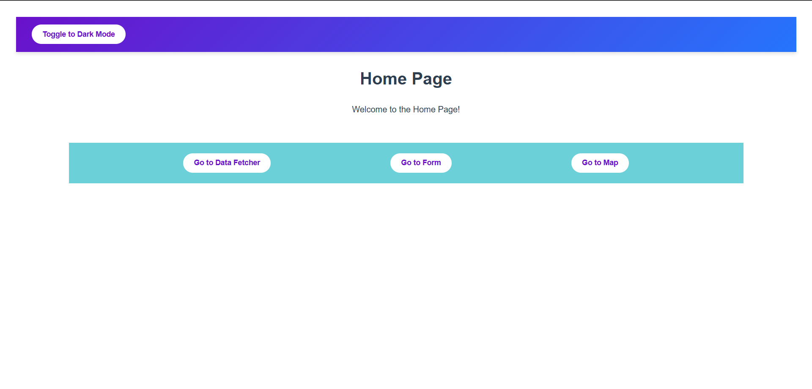
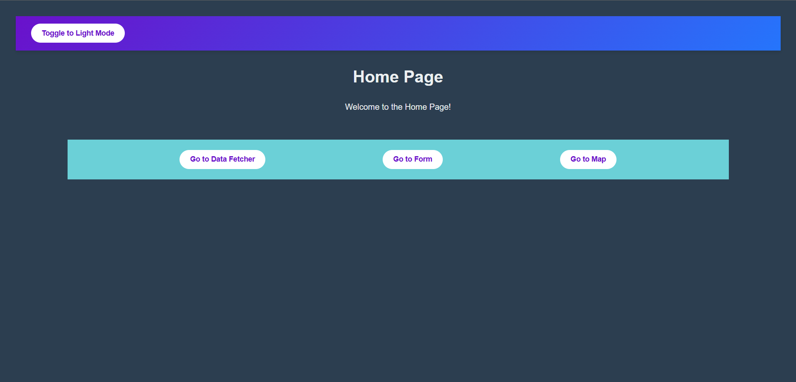
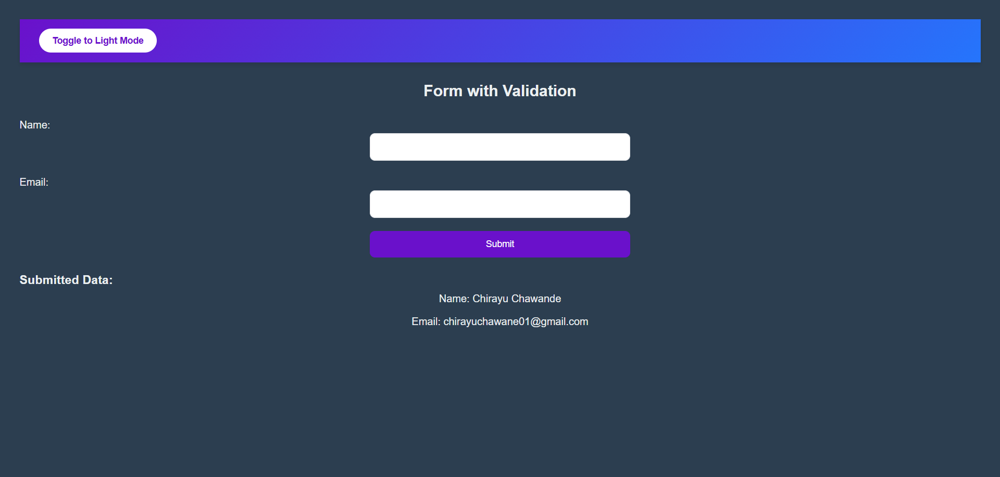
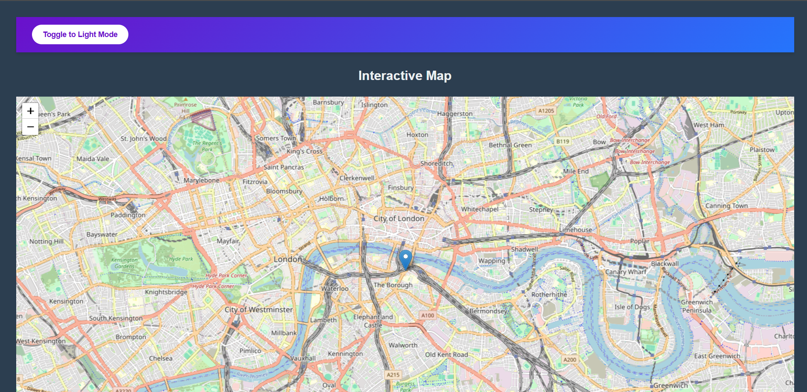

# Frontend Developer Assignment

This repository contains a feature-rich, interactive web application built as part of a frontend development assignment. The app showcases essential skills in React, state management, API integration, routing, and UI/UX design.

The project has been deployed using Vercel and can be accessed at the following link:

🔗 [Live App](https://jarurat-care-assignment-ten.vercel.app/)

## 🚀 Features

### 1. **Dynamic Routing**
- Utilizes React Router for seamless navigation between pages.
- Implements dynamic URL parameters to display detailed views (e.g., `/data/:id`).

### 2. **API Integration**
- Fetches data from a public API using **Axios** and **React Query**.
- Handles loading, error, and caching states gracefully.

### 3. **Form Handling**
- Multi-field form with validation for inputs like name, email, phone number, and password.
- Provides real-time error messages and form submission handling.

### 4. **Theme Switching**
- Light and dark mode themes implemented with **React Context API**.
- Dynamically updates the app’s appearance based on the selected theme.

### 5. **Interactive Map**
- Integrates **Leaflet.js** to display geolocation data.
- Includes markers and popups for interactive map functionality.

### 6. **Responsive Design**
- Ensures a seamless experience across devices (desktops, tablets, and mobiles).
- Styled with modern CSS techniques, including flexbox, gradients, and animations.

### 7. **Animations and Transitions**
- Smooth hover effects and transitions for buttons and other UI elements.
- Enhances interactivity and user engagement.

## 🛠️ Technologies Used

### Frontend Framework
- **React**: Component-based architecture with hooks for state and effect management.

### State Management
- **React Context API**: Provides global state for theme management.
- **React Query**: Efficiently handles API data fetching, caching, and synchronization.

### Routing
- **React Router**: Manages routing and navigation with support for dynamic URL parameters.

### Styling
- **CSS**: Implements responsive and visually appealing styles.
- **Transitions and Animations**: Adds interactivity to the UI.

### API Handling
- **Axios**: Flexible and robust API calls.
- **React Query**: Simplifies data fetching and state synchronization.

### Maps Integration
- **Leaflet.js**: Displays an interactive map with markers and popups.

### Development Tools
- **Vite**: Build tool for a fast and modern development experience.
- **Node.js**: Manages dependencies and runs the development server.

## 📂 File Structure
```
root
├── public
├── src
│   ├── components
│   │   ├── DataFetcher.jsx
│   │   ├── Form.jsx
│   │   ├── Map.jsx
│   │   ├── PostDetail.jsx
│   ├── context
│   │   └── ThemeContext.jsx
│   ├── hooks
│   │   └── useWindowSize.js
│   ├── pages
│   │   ├── Home.jsx
│   ├── App.jsx
│   ├── main.jsx
│   ├── index.css
```

## 💻 Getting Started

### Prerequisites
- **Node.js** (>= 14.x)
- **npm** 

### Installation
1. Clone the repository:
   ```bash
   git clone https://github.com/ChirayuC01/jarurat-care-assignment.git
   ```
2. Navigate to the project directory:
   ```bash
   cd jarurat-care-assignment
   ```
3. Install dependencies:
   ```bash
   npm install
   ```

### Running the App
1. Start the development server:
   ```bash
   npm run dev
   ```
2. Open the app in your browser at `http://localhost:5173`.

### Building for Production
To build the app for production:
```bash
npm run build
```
The production-ready files will be in the `dist` folder.

## 🖼️ Screenshots

### Home Light Mode


### Home Dark Mode

### Data Fetcher

### Form

### Map

